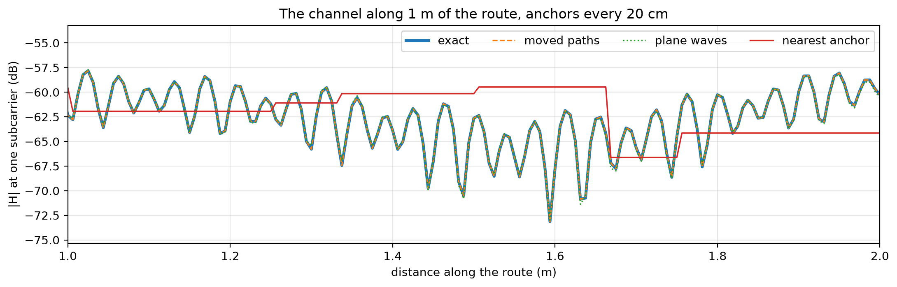
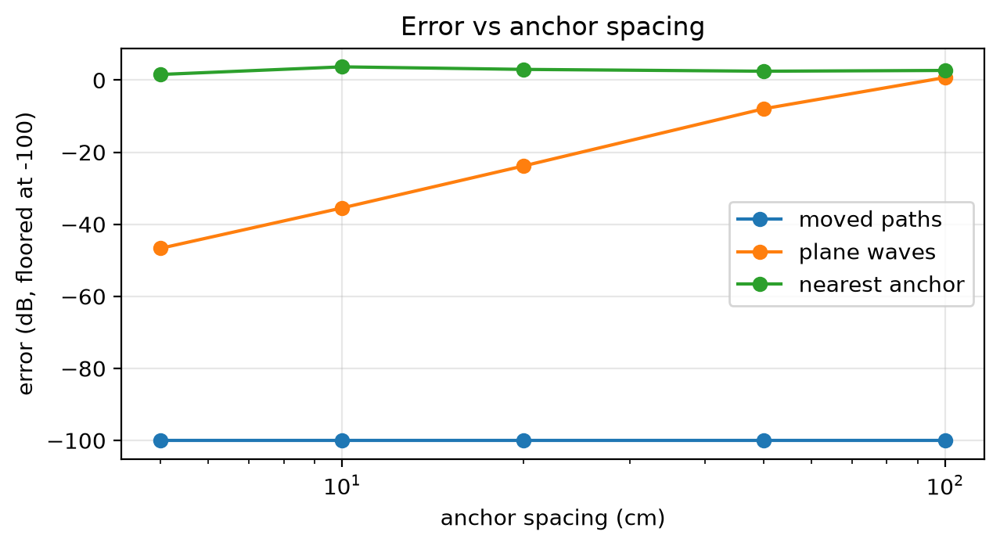
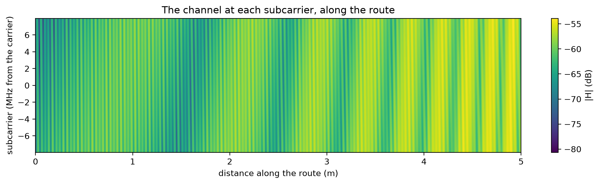

# Channels at continuous positions


<!-- WARNING: THIS FILE WAS AUTOGENERATED! DO NOT EDIT! -->

An access point at the ceiling of a room, and a robot driving through
it. The channel is “ray-traced” at anchor points. Here it’s an exact
image-method model: a line-of-sight path, a reflection off each of two
walls and one double reflection. With a real scene, the anchors would
come from
[`trace_paths`](https://Ahmed-Khaled-Saleh.github.io/comm-core/sionna_rt.html#trace_paths)
and Sionna RT.

Between anchors, the robot’s channel can be taken in three ways:

- **nearest anchor:** the channel of the closest anchor, as it is.
- **plane waves:** the nearest anchor’s paths, with their delays shifted
  to first order.
- **moved paths:** what
  [`RayTracedPathsFading`](https://Ahmed-Khaled-Saleh.github.io/comm-core/propagation.html#raytracedpathsfading)
  does. Each path is moved as a line from an image of the transmitter.

The channel’s phase turns a full circle every wavelength (5.8 cm at 5.18
GHz), so it changes quickly as the robot moves.

``` python
import math

import matplotlib.pyplot as plt
import numpy as np

from comm_core import *
```

``` python
C, F = 299_792_458.0, 5.18e9
SUBCARRIERS = (np.arange(52) - 25.5) * 312.5e3
AP = np.array([0.0, 0.0, 2.4])
WALLS = [(1, 3.0, -0.6), (0, -8.0, -0.5)]                   # (axis, coordinate, reflection coefficient)

def mirror(axis, c):
    m = np.eye(3); m[axis, axis] = -1
    return m, 2 * c * np.eye(3)[axis]

def room_paths(tx, rx):
    "Exact paths: line of sight, one reflection off each wall, and the double reflection (image method)."
    images = [(tx, 1.0, np.eye(3))]
    for axis, c, gamma in WALLS:
        m, shift = mirror(axis, c)
        images.append((m @ tx + shift, gamma, m))
    (a1, c1, g1), (a2, c2, g2) = WALLS
    m1, s1 = mirror(a1, c1); m2, s2 = mirror(a2, c2)
    images.append((m2 @ (m1 @ tx + s1) + s2, g1 * g2, m2 @ m1))
    a, tau, u_tx, u_rx = [], [], [], []
    for source, gain, m in images:
        v = rx - source; L = np.linalg.norm(v)
        a.append(gain * C / F / (4 * np.pi * L) * np.exp(-2j * np.pi * F * L / C))
        tau.append(L / C); u_rx.append(-v / L); u_tx.append(m.T @ (v / L))
    return np.array(a), np.array(tau), np.array(u_tx), np.array(u_rx)

def exact(rx, f=np.zeros(1)):
    a, tau, _, _ = room_paths(AP, np.asarray(rx, float))
    return np.exp(-2j * np.pi * np.outer(f, tau)) @ a

def fading(spacing):
    anchors = grid_points((-7.0, -3.0), (-2.0, 1.0), spacing, height=0.4)
    traced = [room_paths(AP, p) for p in anchors]
    arrays = [np.array([t[k] for t in traced])[None] for k in range(4)]
    return RayTracedPathsFading(AP[None], anchors, *arrays, frequency=F, subcarriers=SUBCARRIERS, node_positions={'ap': AP})

def plane_waves(f, s='ap', r='robot'):
    a, tau, u_dep, d_dep, u_arr, d_arr = f._paths(s, r)
    dtau = -(u_dep @ d_dep + u_arr @ d_arr) / C
    return np.exp(-2j * np.pi * np.outer(f.subcarriers, tau + dtau)) @ (a * np.exp(-2j * np.pi * F * dtau))

def nearest(f, s='ap', r='robot'):
    j = np.argmin(((f.rx_points - f.node_positions[r]) ** 2).sum(-1))
    return np.exp(-2j * np.pi * np.outer(f.subcarriers, f.tau[0, j])) @ f.a[0, j]

route = np.stack([np.linspace(-6.5, -2.5, 801), np.linspace(-2.5, 0.5, 801), np.full(801, 0.4)], 1)   # 5 m, a point every 6 mm
along = np.r_[0, np.cumsum(np.linalg.norm(np.diff(route, axis=0), axis=1))]
```

``` python
f20 = fading(0.20)                                          # anchors every 20 cm
center = len(SUBCARRIERS) // 2
curves = {'exact': [], 'moved paths': [], 'plane waves': [], 'nearest anchor': []}
for p in route:
    f20.set_positions({'robot': p})
    curves['exact'].append(exact(p, SUBCARRIERS)[center])
    curves['moved paths'].append(f20.cfr('ap', 'robot')[center])
    curves['plane waves'].append(plane_waves(f20)[center])
    curves['nearest anchor'].append(nearest(f20)[center])
fig, ax = plt.subplots(figsize=(11, 3.6))
for name, h in curves.items():
    ax.plot(along, 20 * np.log10(np.abs(h)), lw=2.5 if name == 'exact' else 1.2,
            ls={'exact': '-', 'moved paths': '--', 'plane waves': ':', 'nearest anchor': '-'}[name], label=name)
ax.set(xlabel='distance along the route (m)', ylabel='|H| at one subcarrier (dB)', xlim=(1.0, 2.0),
       title='The channel along 1 m of the route, anchors every 20 cm')
ax.grid(alpha=0.3); ax.legend(ncol=4)
plt.tight_layout()
```



The nearest anchor’s channel jumps from anchor to anchor and misses the
fades in between: the deep dips, where the paths cancel. Plane waves
follow it close to the anchors and drift between them. Moved paths
follow the exact channel.

How the error grows with the spacing of the anchors (normalized mean
squared error over the route and the 52 subcarriers):

``` python
spacings = [0.05, 0.1, 0.2, 0.5, 1.0]
errors = {'moved paths': [], 'plane waves': [], 'nearest anchor': []}
truth = np.array([exact(p, SUBCARRIERS) for p in route[::4]])
for spacing in spacings:
    f = fading(spacing)
    est = {k: [] for k in errors}
    for p in route[::4]:
        f.set_positions({'robot': p})
        est['moved paths'].append(f.cfr('ap', 'robot')); est['plane waves'].append(plane_waves(f)); est['nearest anchor'].append(nearest(f))
    for k in errors:
        errors[k].append(10 * np.log10(np.sum(np.abs(np.array(est[k]) - truth) ** 2) / np.sum(np.abs(truth) ** 2)))
fig, ax = plt.subplots(figsize=(6.5, 3.6))
for k, e in errors.items():
    ax.plot(np.array(spacings) * 100, np.maximum(e, -100), 'o-', label=k)
ax.set(xscale='log', xlabel='anchor spacing (cm)', ylabel='error (dB, floored at -100)', title='Error vs anchor spacing')
ax.grid(alpha=0.3); ax.legend()
plt.tight_layout()
print({k: [round(x, 1) for x in e] for k, e in errors.items()})
assert all(e < -60 for e in errors['moved paths']) and all(e > -5 for e in errors['nearest anchor'])
```

    {'moved paths': [np.float64(-263.7), np.float64(-263.1), np.float64(-263.2), np.float64(-262.6), np.float64(-262.3)], 'plane waves': [np.float64(-46.7), np.float64(-35.5), np.float64(-23.8), np.float64(-7.9), np.float64(0.7)], 'nearest anchor': [np.float64(1.6), np.float64(3.7), np.float64(3.0), np.float64(2.5), np.float64(2.7)]}



- **In this room, moved paths are essentially exact at any spacing.**
  Its walls are flat, the access point is fixed and no path appears or
  disappears.
- **In real scenes, the limit is paths appearing or disappearing between
  anchors.** The validation against Sionna RT in `sionna_rt` measures
  it: −47 to −63 dB with a fixed access point, for anchors up to 50 cm
  apart.
- **The anchors can be far apart.** Moving the paths, rather than taking
  the nearest anchor, is what allows it.

Over the 52 subcarriers, the channel along the route is
frequency-selective, so different subcarriers fade at different places:

``` python
f5 = fading(0.05)
grid = []
for p in route:
    f5.set_positions({'robot': p})
    grid.append(20 * np.log10(np.abs(f5.cfr('ap', 'robot'))))
fig, ax = plt.subplots(figsize=(11, 3.2))
im = ax.imshow(np.array(grid).T, aspect='auto', origin='lower', extent=[along[0], along[-1], SUBCARRIERS[0] / 1e6, SUBCARRIERS[-1] / 1e6], cmap='viridis')
fig.colorbar(im, ax=ax, label='|H| (dB)')
ax.set(xlabel='distance along the route (m)', ylabel='subcarrier (MHz from the carrier)', title='The channel at each subcarrier, along the route')
plt.tight_layout()
```


